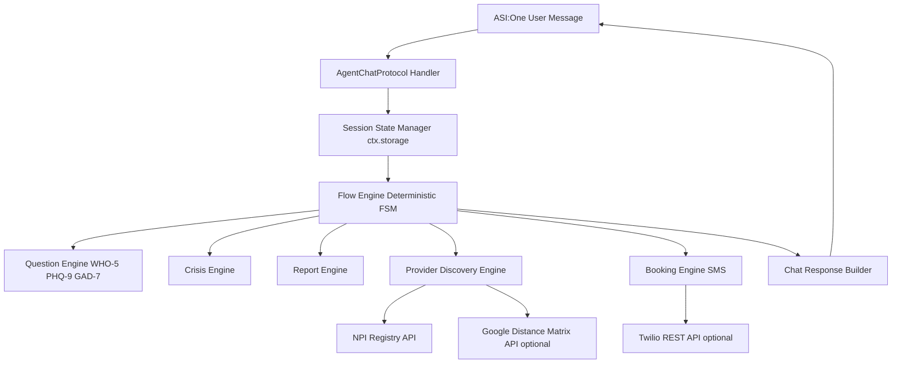

# Single-Agent Architecture

This project runs as a single hosted orchestrator agent on Agentverse.

## System Diagram

## Runtime State Machine

- `WARM_OPEN`
- `WHO5_SCREEN`
- `PHQ9`
- `GAD7` (conditional)
- `CRISIS` (interrupt state)
- `REPORT_READY`
- `BOOKING`
- `SESSION_CLOSE`

All state is persisted in `ctx.storage` using session-scoped keys.

## Key Design Decisions

- Single runtime agent (no inter-agent routing at chat time)
- Deterministic scoring and branching rules
- Crisis interruption has highest priority
- Graceful API degradation:
  - No Google Maps key: provider list still returns without distance ranking
  - No Twilio credentials: booking summary still completes with SMS skipped status

## External Integrations

- NPI Registry API: provider lookup
- Google Distance Matrix API (optional): distance/time ranking
- Twilio REST API (optional): SMS confirmation
